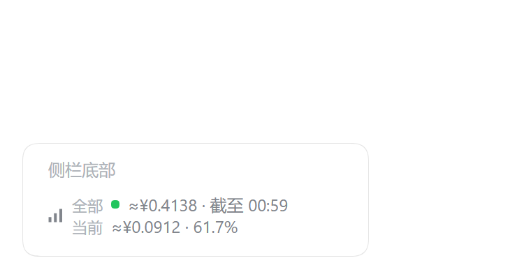
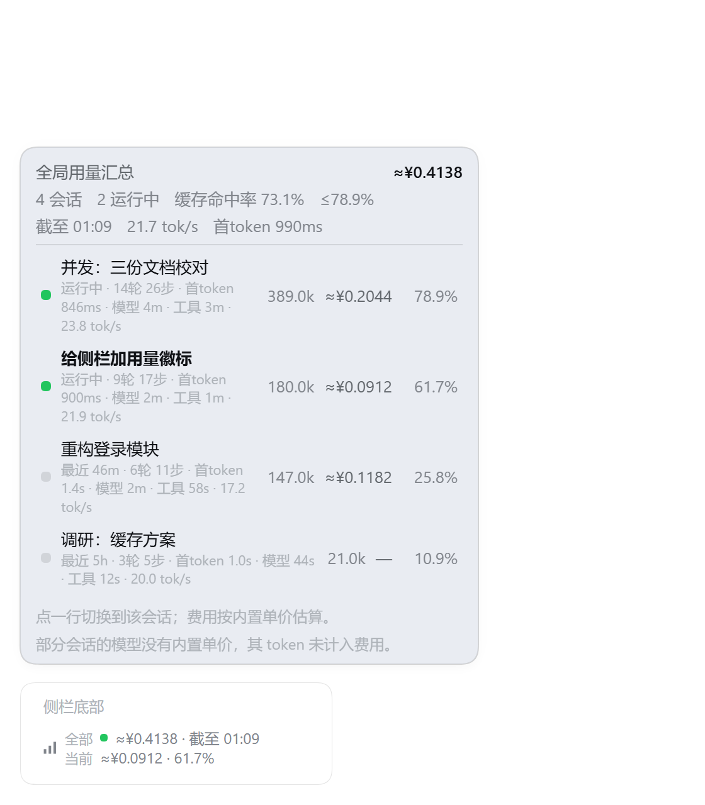
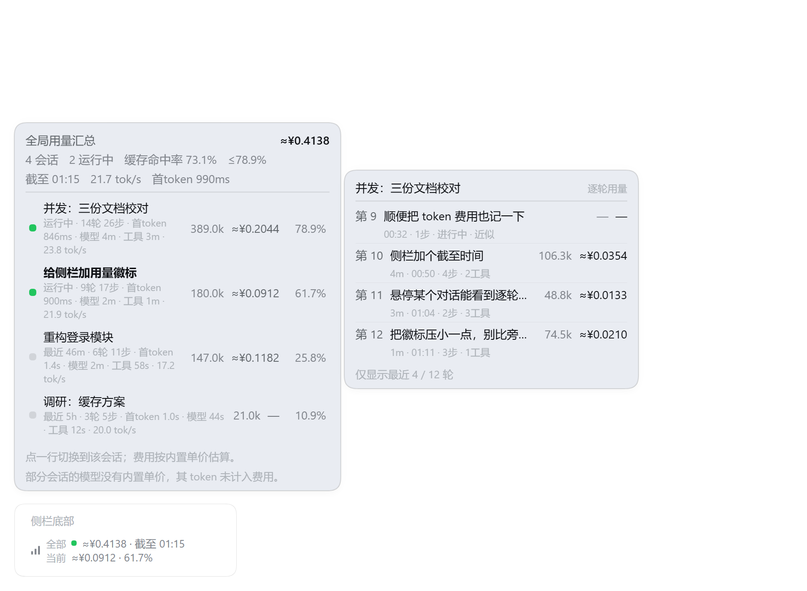
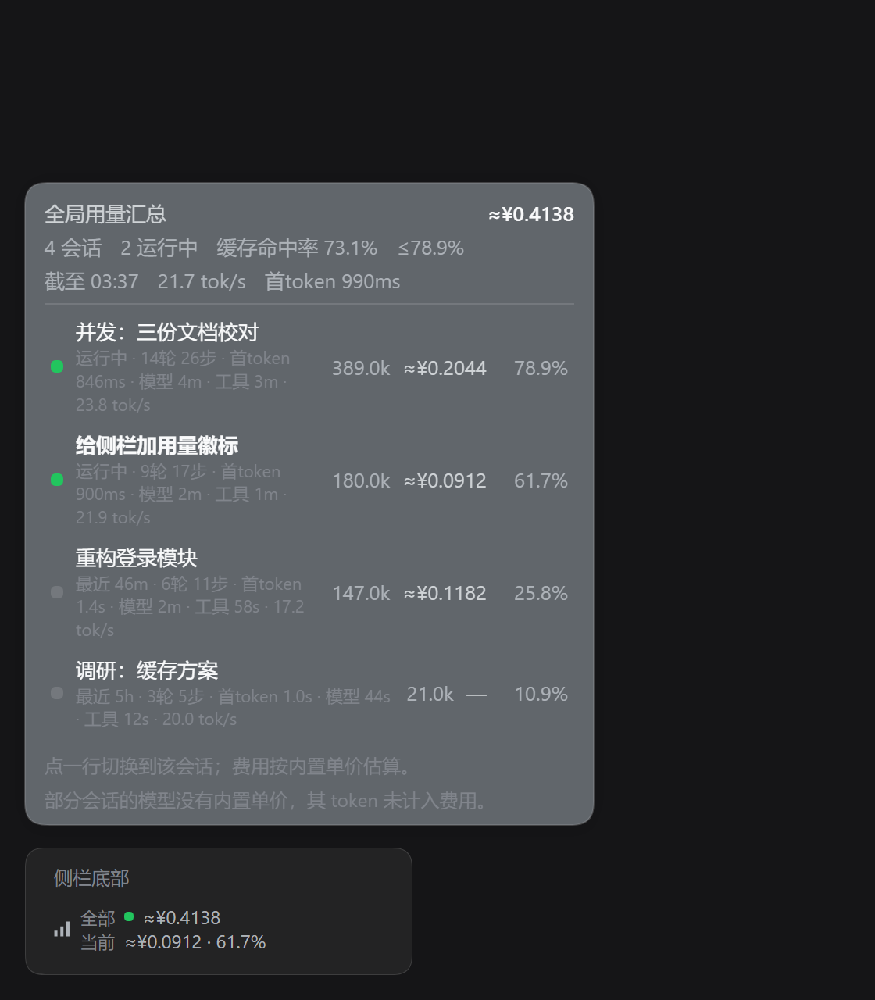

# dsh-token-cost

> **English** — Live token usage and estimated cost in the DSH sidebar: every session combined plus the
> current task; **hover** to expand a per-session breakdown with time detail (elapsed, turns/steps,
> first-token, model vs tool time, decode speed) and the as-of clock, then **hover a single row** for
> that conversation's per-turn usage, cost and prompt summary — click a turn to jump to it.
> Cost is estimated from an editable price table; the plugin adds no model calls, prompts or tools.

侧栏底部常驻的**用量与费用账本**：全部会话合计 + 当前任务（有任务在跑时金额前一个绿点）。
这份账目的**截至时刻**只在悬停展开的面板里显示。

```
全部 ●≈¥0.1240
当前  ≈¥0.0330 · 45.4%
```

**鼠标悬停**展开逐会话明细（移开自动收起，点一下可钉住）。每个任务两行：

- 第一行：状态圆点 / 标题 / token / 费用 / 上下文占用百分比 —— **当前任务加粗**，点行切换会话，运行中排最前；
- 第二行（时间）：`运行中 12m` 或 `最近 3m`、轮/步、平均首 token、模型耗时、工具耗时、解码 `tok/s`。

侧栏收起时降级为只显示合计金额。输入框下方**刻意不显示任何东西**——同一份合计不重复出现。

**悬停某一个对话行**，在**那一行右侧**再弹一层该会话的**逐轮用量**：每轮一行 = 轮号 + **触发它那句话**，
下面一行是 `用时 · 时刻 · 步数 · 工具数`；有重试标「近似」、未闭合标「进行中」、用量不可证明时显示 `—`。
**点某一轮会切到该会话并把主视图落到那一轮**。数据来自该会话的日志（Host 半侧读），
折叠是本插件自带的实现（按轮累加 provider 上报的用量）。

## 截图

| 侧栏底部（两行徽标） | 明细面板（悬停展开） |
|---|---|
|  |  |

**悬停某个对话行 → 逐轮用量**：



深色主题：



> 截图由 `node tools/render-panel.mjs` 生成：把**真实组件**渲染成 HTML（主题变量取自本机安装的
> `dsh-client-ui-theme`，用 `node tools/extract-theme.cjs` 抽出），再用无头 Chrome 出图。
> **图中的任务是虚构样本**，不是任何人的真实用量与费用。

## 快速上手

1. 装：`dsh plugin --profile desktop add github:wojiao42/dsh-token-cost`（或从插件市场安装），刷新页面。
2. 看侧栏底部那两行：全部会话（含截至时刻，有任务在跑时前面有个绿点）/ 当前任务。
3. **鼠标悬停**看明细，再**悬停某一行**看该会话的逐轮用量；若某些后台任务还没取到数据，
   点底部 **「载入其余会话 · N」**。
4. 逐轮用量由 Host 半侧提供：**改过 `index.js` 后需要重启一次 Harness**（客户端会提示）。

## 界面

| 元素 | 内容 |
|---|---|
| 徽标第一行 | `全部 ≈¥0.12`：全部会话的估算费用合计（有任务在跑时金额前有一个绿点）；截至时刻不在这里 |
| 徽标第二行 | `当前 ≈¥0.03 · 45.4%`：主视图里那个任务的费用 + 上下文占用 |
| 徽标尺寸 | 两行、12px 行高 1.25——侧栏 footer 是单行 flex 槽位，故意压到与旁边的单行按钮同一量级 |
| 展开方式 | **悬停**即展开（移开 0.2 秒后收起）；点击钉住 / 取消钉住；键盘 focus 同样展开 |
| 面板头部 | 合计金额；元信息：会话数 / 运行中数 / 缓存命中率 / 最高占用 / **截至时刻 / 整体 tok/s / 平均首 token** |
| 面板列表 | 每行两行：标题行（圆点、标题、token、费用、占用%）+ **时间行**（见下） |
| 词条 | `运行中 12m` / `最近 3m` · `7轮 12步` · `首token 1.2s` · `模型 4m` · `工具 3m` · `23.8 tok/s` |
| **逐轮预览** | **悬停某一行**，在**那一行右侧**弹出：每轮 = `第 12 轮 + 触发它那句话`，下面一行 `用时 · 时刻 · 步数 · 工具数`；有重试标「近似」、未闭合标「进行中」、用量不可证明时显示 `—`；底部提示「仅显示最近 4 / 12 轮」 |
| 点某一轮 | **切到该会话，并把主视图落到那一轮** |
| 面板底部 | 「载入其余会话 · N」（仅在还有会话没取到数据时出现） |


侧栏收起时只有一行金额——宽度不够放两行。

## 数据与口径

- **不新增任何模型调用、提示词或工具**：全部来自已有会话投影
  （`tokenUsage` / `contextPressure` / `modelSelection`，估算器就是官方 `dsh-token-meter`）。
- **上下文占用** = `contextPressure.projectedTokens / contextWindow`，与内置的上下文圆环同源。
- **冷会话取证**：Host 的控制基线只覆盖当前活跃 Session，后台任务/其他窗口的会话是冷会话，
  列表里没有它们的投影。插件对缺数据的会话调用客户端已有的
  `ctx.sessions.refreshProjections(id)`（官方语义：**不打开会话也能读它的全部投影**），
  顺序是**运行中优先**、其次按最近更新；每次列表更新最多取 48 个，取过的不重复请求；
  打开面板时会重试仍缺数据的会话。
- **取不到的会话**：已删除/已归档、不在会话列表里的会话没有数据，不计入合计。

### 时间信息从哪来

| 显示 | 来源 | 精度 |
|---|---|---|
| `截至 HH:MM` | 会话列表里**有用量会话的最近活动时间**（`updatedAt`）取最大值 | 与 Host 的列表更新同源 |
| `运行中 12m` | 客户端**首次观察到该会话处于运行中**的时刻起算，面板打开时逐秒刷新 | 近似（页面打开后才开始计时；刷新页面重新起算） |
| `最近 3m` | `updatedAt` 到现在的相对时间 | 同上 |
| 轮/步、首 token、模型耗时、工具耗时 | 官方 `sessionStats` 投影（`turns` / `steps` / `ttftMs` / `ttftSteps` / `llmMs` / `toolMs`） | 精确：按会话日志折叠，压缩与分页都不影响 |
| 解码 `tok/s` | `sessionStats.decodeTokens / decodeMs` | 精确 |

**没有的东西**：投影里不带「本次运行开始的绝对时刻」，所以运行时长的起点只能用客户端观察值近似。
「今日花费 / 近 5 分钟花费」这类按时间分桶的账目需要事件时间，现有投影不提供。

### 逐轮用量从哪来

| 项 | 做法 |
|---|---|
| 数据源 | 该会话的**日志事件**：Host 半侧用 `ctx.sessionQuery.read(id)` 读（冷会话走持久化日志，活跃会话走 live 分支） |
| 折叠 | 官方 `@deepseek-ai/dsh-token-meter` 的 `deriveTurnTokenUsage`（逐次尝试、重试、闭合校验都在里面），与聊天里的「本轮用量」同源 |
| 接口 | `GET /token-cost/turns?sessionId=<id>&limit=30[&refresh=1]` |
| 缓存 | Host 侧按会话缓存 15 秒，客户端再缓存 15 秒；悬停有 140ms 防抖，指针扫过不会连发请求 |
| 返回范围 | 只回最近 N 轮（默认 30、上限 200），回包带 `totalTurns` 与 `truncated` |
| 显示 `—` | 官方折叠在「活动未闭合 / 计数不安全 / 与总量矛盾」时判定不可用，插件照原样显示，不猜 |

> **改过 `index.js` 必须重启 Harness 一次**（Host 模块不参与热重载，`dsh-hmr` 只做组合层）。
> 重启前客户端会显示「逐轮数据需要重启一次 Harness」。

## 单价与费用

费用 = 未缓存输入 × `cacheMiss` +（缓存读 + 缓存写）× `cacheHit` + 输出 × `output`，
按当前模型查表。表在 `client.js` 顶部：

```js
const PRICES = {
  'deepseek-flash': { cacheHit: 0.02, cacheMiss: 0.4, output: 4 },
  'deepseek-v4-pro': { cacheHit: 0.02, cacheMiss: 0.4, output: 4 },
};
```

单位是**人民币元 / 每百万 token**。表里没有的模型只显示 token 与占用，费用列显示 `—`
并在面板里提示未计入。

> **这是估算值，不是账单。** 默认单价按公开调价信息填写；插件也无法感知折扣、赠送额度、
> 不同计费档位与图片/文件计价。`dsh-token-meter` 的文本计量本身是「每 token 四字符」的
> 固定启发式规则，对 CJK 与 JSON 会低估。要对账请以官方账单为准，或按实际价格改表。

## 安装

**方式一：从 GitHub 装（发布后的正式方式）**

```sh
dsh plugin --profile desktop add github:wojiao42/dsh-token-cost
```

卸载：`dsh plugin --profile desktop remove dsh-token-cost`。

**方式二：本地源码开发**

| 位置 | 说明 |
|---|---|
| `<工作区根>\plugins\dsh-token-cost` | **源码**，改这里 |
| `<插件安装根>\dsh-token-cost` | 指向源码目录的目录联接（junction），作为安装源路径 |
| `…\.dsh\profiles\desktop\node_modules\dsh-token-cost` | 指向 `<插件安装根>\…` 的目录联接 |

profile 的 `package.json` 里登记为组合包（**必须**用 pnpm 的 `link:` 协议，
`file:` 会把目录硬链/复制进 `node_modules`，之后改源码不生效）：

```json
"dependencies": { "dsh-token-cost": "link:<插件安装根>/dsh-token-cost" },
"dsh": { "profile": { "bundles": [ "…", "dsh-token-cost" ] } }
```

## 文件

| 文件 | 作用 |
|---|---|
| `package.json` | 插件清单：`dsh.bundle.patch` 与 `dsh.client`（`platform: web`、`immediately`、`inject: dsh-client-ui-sidebar`） |
| `index.js` | Host 半侧：注册 `GET /token-cost/turns`，按需读会话日志并折叠出逐轮用量（改动需重启一次 Harness） |
| `client.js` | 浏览器半侧：侧栏两行徽标 + 明细面板（构建产物直接提交，git 安装不跑构建） |
| `cordis.patch.yml` | 组合包 patch：插入 `token-cost` 行（`name` 必须等于包名） |
| `tools/plugin-summary-test.cjs` | 44 项离线断言（假 React/ReactDOM/hook harness，不需要浏览器） |
| `tools/turns-test.mjs` | 25 项离线断言：逐轮切分 + 折叠接线 + 路由契约（假 ctx / 假 sessionQuery） |
| `tools/verify-live.cjs` | 检查运行中的 Host 是否已在提供当前版本 |
| `tools/extract-theme.cjs` | 从本机 `app.asar` 抽出主题样式表（纯 node 读 asar），供出图用 |
| `tools/render-panel.mjs` | 把真实组件渲染成 HTML + 无头 Chrome 出商店截图 |
| `tools/lib/harness.mjs` | 离线 harness：假 React/ReactDOM + `client.js` 加载器 |
| `tools/publish.mjs` | GitHub 侧发布：建仓 + 推送 + topic + 收录条目，见 `PUBLISHING.md` |
| `screenshots.json` · `assets/` | 商店页截图声明与图片 |

## 改完代码怎么生效

客户端 bundle 在**条目被移除后重新加入**时才会重新读文件（`artifactRevision` 只看
mtime/ctime/size），所以改完 `client.js` 要重挂一次这个包：

1. **不重启（推荐）**：侧栏「插件」页找到 `dsh-token-cost`，开关**关掉再打开**。
2. **等价的文件做法**：把该包从 profile 的 `dsh.profile.bundles` 里删掉，等几秒
   （`dsh-hmr` 会重新组合 profile，旧 rev 立刻 404），再加回末尾。

**Host 半侧 `index.js` 改动必须重启 Harness**：Node 的 ESM 模块缓存按文件 URL 命中，
重挂组合包不会重新求值 Host 模块（DSH 也禁用了模块根热重载）。客户端在路由 404 时会提示这件事。

## 测试

```
node plugins/dsh-token-cost/tools/plugin-summary-test.cjs   # 45 项：注册面、三行徽标、当前任务标记、
                                                            #   金额算式、排序、未知模型、冷会话取证、
                                                            #   载入其余、空列表、注入源、时间明细、
                                                            #   悬停展开、逐轮预览取数
node plugins/dsh-token-cost/tools/turns-test.mjs            # 26 项：逐轮切分、折叠接线、路由契约
node plugins/dsh-token-cost/tools/verify-live.cjs           # 运行中的 Host 是否已在提供当前版本
```

三个脚本的退出码都必须为 0。

## 投稿到插件市场

社区精选目录 [awesome-dsh-plugin](https://github.com/awesome-dsh-plugin/awesome-dsh-plugin)
（`dsh-plugin.org` 的条目由它同步）用**一个仓库一个 YAML** 收录：

```yaml
url: https://github.com/wojiao42/dsh-token-cost
name: wojiao42/dsh-token-cost
category: usage
description:
  en: 'Live token usage and estimated cost in the sidebar: the current task plus every session combined, with cache-hit rate and a per-session breakdown.'
  zh: 侧栏里实时显示 token 用量与估算费用：当前任务与全部会话合计，含缓存命中率与逐会话明细。
```

分类选 `usage`（「用量」）：插件做的事就是统计与展示用量/费用。
完整流程与检查表见 `PUBLISHING.md`。

## 常见问题

**为什么只有侧栏一处，输入框下方没有？**
早期版本在输入框下方也有一个「本会话」药丸，两处显示同一类数字属于重复。现在只保留侧栏一处，
把「全部」与「当前」并排放在同一块。

**为什么合计和我看到的当前会话对不上？**
合计包含所有会话（含后台任务与子智能体）。冷会话第一次要按需取证，几毫秒内补齐；
还没补齐时面板底部会出现「载入其余会话 · N」。

**费用准吗？**
是估算。单价表可改；官方计量本身对 CJK/JSON 有低估，且插件看不到折扣与赠送额度。
要对账以官方账单为准。

**会发额外请求吗？**
不发模型请求。只在客户端向本机 Host 读会话投影（冷会话取证走的是官方 `session.projections` 接口）。

**侧栏收起后看到什么？**
只有一行合计金额（宽度不够两行），面板照常点开。

## 已知边界

- **已删除/已归档、不在会话列表里的会话取不到数据**，不计入合计。
- **上下文占用是参考值**：`projectedTokens` 含启发式误差，与内置圆环同源，不等于计费规模。
- **每次列表更新最多自动取证 48 个冷会话**，其余需要点一次「载入其余会话」。
